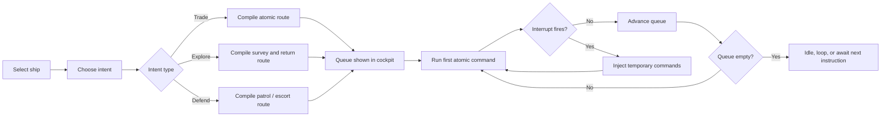
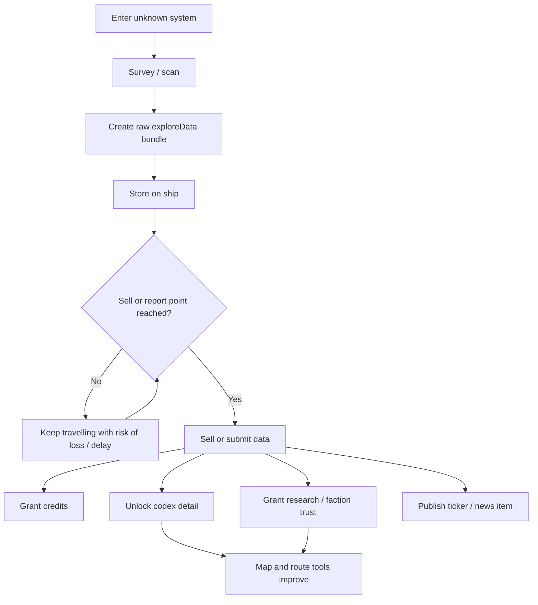

# Starweft Space Logistics Design Research

## Executive summary

The strongest lesson from the survey is that Starweft should double down on **logistics as the primary authored verb**, while making **exploration a form of valuable, risky information cargo** and treating combat and defence as consequential interruptions to trade rather than the centre of the game. The closest design lineage is not a single title but a blend: **Elite Dangerous** for delayed cash-out of exploration data, **Sunless Sea** for “bring knowledge home” loops, **X4: Foundations** and **Distant Worlds 2** for living economies driven by transport, **Slipways** and **Offworld Trading Company** for trade-first strategy, and **Factorio** for composable command grammar and reservation-aware automation. The result for Starweft should be a game where ships continuously run intelligible orders such as **survey → collect → haul → deliver → sell/report → unlock new options**, and where the background simulation reacts to those flows instead of feeling decorative. citeturn24search0turn24search17turn24search23turn25search18turn37view0turn38view0turn28view0turn22search6turn39view0turn39view1

The most important concrete change is to introduce an **`exploreData` economy**. Elite Dangerous only pays explorers when they sell data through Universal Cartographics, and No Man’s Sky makes discoveries a persistent system that can be uploaded and rewarded later; Sunless Sea’s port reports achieve a similar loop in narrative form. For Starweft, that means explorers should generate bundles of map data, anomaly readings, system surveys, and codex entries while travelling, but those bundles should stay “unsold” until returned to a populated site or specialist vendor. That creates tension, route planning, a reason to come home, and a direct bridge between discovery, economy, codex, research, and UI. citeturn24search0turn24search5turn24search17turn15search1turn15search6turn15search15turn25search18turn4search22

The second major change is to replace a loose set of point features with a **clear command grammar**. The best evidence here comes from Factorio’s train interrupts and reservations, X4’s predefined trade behaviours, and the negative player reaction to Avorion when its new automation replaced direct chaining with opaque “operations”. Starweft should expose a small set of atomic orders, make them chainable, add conditional interrupts, and keep the whole queue visible from one “selected ship cockpit” panel. The command layer should feel like a language, not a collection of special buttons. citeturn39view0turn39view1turn37view0turn35view0turn36view0

The third major change is to treat world seeding and market setup as a **simulation-balancing problem**, not a hand-tuned pile of starting numbers. Research on Machinations and graph-based economy balancing argues that small numerical changes can radically alter an internal economy, and proposes simulation-first balancing precisely because of that sensitivity. In practice, Starweft needs a `worldParams` object plus a validator that simulates the opening months without player intervention and rejects seeds that are either deadlocked or already saturated. This is the right answer to your concern that a deprived Sol is thematically good but may still need better seeding for interesting dynamics. citeturn32search15turn32search2turn30view0

The fourth major change is UX consolidation: keep the bottom ticker, but make it the home for ambient flavour, market headlines, route updates, and world-state notifications; reserve the infobox for bounded, reliable hover explanations; remove the command box in favour of a cockpit-style ship panel; and rationalise aptitudes so that they read as modifiers on verbs the player already understands. FTL’s developers explicitly prioritised the fantasy of “being the captain of a starship”, and Factorio’s recent UI work is notable for surfacing “trains on the way”, reservations, and copyable defaults instead of burying system state. The lesson is simple: Starweft should privilege **clarity of current intent, next consequence, and reason-why** over raw density. citeturn4search2turn4search6turn39view2turn39view3turn18view1

## Comparative survey of exemplar games

The table below focuses on transferable lessons rather than broad review coverage. I have included a few **control exemplars** that are not pure space-trucking games but are unusually relevant to Starweft’s command grammar, logistics readability, and internal economy design. citeturn22search12turn32search15turn30view0

| Exemplar | Core transferable idea | Logistics loop | Exploration / encounter / UI / automation / reward timing | Best fit for Starweft | Sources |
|---|---|---|---|---|---|
| **Elite Dangerous** | Exploration becomes valuable only when sold at civilisation | Scan systems and bodies, then return to sell exploration data | Strong delayed cash-out; Codex ties discoveries to knowledge; richer scans pay more; death risk before turn-in matters | `exploreData`, codex, vendor turn-in, “further + stranger = better” valuation | citeturn24search0turn24search5turn24search17turn24search23 |
| **EVE Online** | Economies feel alive when logistics is a profession and the market is observable | Courier contracts, hauling, player market redistribution | Player-driven markets, economic reports, collateral/risk, hauling corps, clear profession identity | Hauling jobs, freight contracts, market visibility, systemic demand generation | citeturn8search2turn8search13turn8search4turn23search0 |
| **X4: Foundations** | Good logistics AI needs explicit behaviours and trade rules | Automine, autotraders, fill-shortages, station trade rules | One-buy-many-sells “run”; blacklists; repeat orders; visible empire-scale trade controls | Atomic ship orders, route templates, trade rules, danger-aware AI | citeturn37view0turn37view1turn37view2turn7search13 |
| **Distant Worlds 2** | Split state and civilian flows so the world can evolve without direct micromanagement | State explores and builds; private ships mine, freight, and pay their own costs | Spaceports as hubs; shortages propagate; automation can be tuned rather than simply on/off | `economy.js` / `sites.js` split between infrastructure and civilian hauling; validator for supply chains | citeturn38view0turn17view0turn18view2 |
| **Slipways** | Make trade itself the puzzle and let planets upgrade from the resulting network | Assign industries and connect planets with routes | Trade-first, no-war focus; immediate consequences; strong pre-run modifiers and scenario variety | World parameter presets, route readability, prosperity from network completion | citeturn28view0turn27view0turn5search1 |
| **Starsector** | Exploration should feed longer-term economy and strategic geography | Survey, salvage, colonise, respond to pirate disruptions | Survey data, rare loot, colony conditions, pirate activity hurting markets | Survey data bundles, economically meaningful piracy, discovered-site value | citeturn10search0turn10search12turn9search9turn9search22 |
| **No Man’s Sky** | Discoveries are content, currency, and map memory at once | Scan, log, upload, revisit, share | Discovery page, uploads, renamed finds, expedition milestones, shared discoveries | Discovery ledger, upload/sell UX, codex-as-map-memory, wonder tracking | citeturn15search1turn15search6turn15search15turn14search0 |
| **Sunless Sea** | “Bring back information” is a powerful homecoming loop | Gather port reports and intelligence, return to London | Return hub as emotional and economic heartbeat; encounters justify themselves through text and consequence | Turn-in of port reports / exploration data at hubs; encounters as authored moments, not generic blockers | citeturn4search1turn25search18turn25search12turn25search0 |
| **FTL** | UI should make the player feel like a captain dealing with acute situations | Route choice, ship management, high-salience event decisions | Event popups work because they deliver unique, high-pressure choices; captain fantasy is central | Cockpit-centric selected-ship UI; encounter panels only for events that cannot be told elsewhere | citeturn4search2turn4search6 |
| **Space Haven** | Logistics throughput becomes legible when hauling work, bundling, and specialised jobs are surfaced | Crew and logistics bots move goods through a ship/base | Logistics bots, bundled cargo, roles separated from system jobs | Cargo batching, haul-job metrics, ship role UI, throughput debugging | citeturn11search6turn11search2 |
| **Avorion** | Captains and long-form map commands are attractive, but players punish opacity and loss of direct control | Send mine/trade/scout operations via map | Useful idea, risky execution; complaints focused on broken chaining, hidden operations, and replacement of old loops | Keep new automation strictly additive; never remove manual chaining; always show what a ship is doing and why | citeturn35view0turn36view0 |
| **ΔV: Rings of Saturn** | Hard-sci hauling and diegetic information deepen the space-trucker fantasy | Mine, haul, dock, read station news, manage hardware | HUD/cockpit emphasis, autopilot refinements, in-world news bulletins, salvage-law fiction | Ticker/newsfeed as diegetic world-state channel; cockpit UI with practical telemetry | citeturn19search5turn19search6turn19search4 |
| **Offworld Trading Company** | Price movement can be the conflict, not just a backdrop | Extract, sell, arbitrage, manipulate markets | Trade-first RTS; free-market loops and replayable economic systems | Make logistics and demand the main drama; let scarcity and supply shifts create stories | citeturn22search6turn22search11turn22search4 |
| **Factorio** | Small, composable rules plus reservations and interrupts create powerful automation | Pickup, deliver, refuel, reroute, reserve station capacity | Train limits prevent dogpiling; interrupts add conditional one-shot orders; UI shows incoming trains and inherited defaults | Auto-explore reservation map, interrupt-based orders, clear queue introspection, copyable route templates | citeturn39view0turn39view1turn39view2turn39view3 |

## Design lessons for Starweft

The clearest cross-game pattern is that players stay engaged when the game gives them a **stable high-level goal** and lets many systems express that goal from different angles. In Slipways, Offworld and X4 the player is fundamentally arranging flows; in Elite Dangerous and Sunless Sea the flow is information as much as cargo; in Distant Worlds 2 the background economy validates those flows by making shortages, hubs and routes materially consequential. For Starweft, this means all three branches you described should be legible as consequences of one spine: **logistics links the world together; exploration discovers what can be linked; combat and defence protect or disrupt those links**. citeturn28view0turn22search6turn37view0turn24search0turn25search18turn38view0

The exploration lesson is even more specific: **exploration should produce structured data, not just cash or fog-of-war reveal**. Elite Dangerous ties value to scan depth and weirdness, No Man’s Sky turns discoveries into a persistent knowledge layer, and Sunless Sea turns information into a tradable, return-home object. That design is stronger than immediate scan rewards because it creates a delayed reward arc, lets the home port matter, and naturally integrates codex, market, research and narrative. I therefore recommend that Starweft explorers accumulate distinct categories such as `systemSurvey`, `bioscan`, `anomalyTrace`, `routeIntel`, and `culturalReport`, each with different buyer types, perk hooks and UI affordances. citeturn24search17turn24search23turn15search1turn15search15turn25search18turn4search22

On pacing, the best games separate **moment-to-moment rewards** from **strategic rewards**. Phillips’ reward taxonomy remains broadly applicable, and recent work argues that contemporary games also rely heavily on **currency rewards** and **self-expression rewards**. Starweft should therefore avoid making every good outcome a payout. A completed haul can yield credits, but also route knowledge, faction trust, new codex entries, ship badge/history, improved autopilot confidence, and future contract access. That variety will make aptitudes and perks feel more coherent because they will modify recognisable reward categories instead of acting like isolated stats. citeturn33view0

A crucial warning from recent UX research is that **secondary reward-chasing can narrow exploration behaviour**. In a 2024 study of open-world level design, adding “coin collection” as a secondary task reduced spatial exploration interest relative to the designed environment. That is directly relevant to Starweft. If exploration data is surfaced as “pick up these ten glowing things”, you will undermine the fantasy you want. The right pattern is to let exploration rewards emerge from surveying routes, strange systems, and meaningful scanning actions that overlap with navigation rather than distract from it. citeturn34view0

The command-grammar lesson is straightforward. Factorio’s interrupt system works because the rule is tiny: “when condition X becomes true, inject these temporary stops”. X4’s “fill shortages” works because it is a clear, named behaviour with understandable constraints. Avorion’s 2.0 backlash happened because the new command system made ships feel more opaque and less chainable even while adding interesting captain features. For Starweft, the atomic verbs should be few, composable and always visible: `MOVE`, `DOCK`, `LOAD`, `UNLOAD`, `BUY`, `SELL`, `SURVEY`, `SCAN`, `SELL_DATA`, `PATROL`, `DEFEND`, `REPAIR`, `WAIT`, and `CALL_HELP`. Everything else should compile into those verbs. citeturn39view0turn37view0turn35view0turn36view0

The world-economy lesson is that **scarcity must create prompts, not deadlocks**. Distant Worlds 2 demonstrates a strong model: exploration reveals resource nodes, private actors move them, and spaceports become hubs; Starsector shows how pirate activity can create market conditions; Offworld and Slipways both show how price and network shifts create the actual strategy. Starweft’s opening seed therefore wants a world that is visibly short on essentials, but not empty to the point of triviality or paralysis. In practice, this argues for a post-generation validator that rejects seeds where no interesting transport decisions exist, where major nodes already self-satisfy, or where key chains cannot get started at all. citeturn38view0turn9search9turn22search6turn28view0turn30view0turn32search15

The encounter lesson is not “more pop-ups”; it is **make event surfaces rare and justified**. FTL’s event panel works because it gives the player high-salience decisions that are not well represented elsewhere. Failbetter’s Sunless Sea works because port text is where theme, uncertainty and consequence live. Your instinct is right: if an encounter can be represented in the route list, market list or tooltip, it should not become a blocking panel. Starweft’s encounter panels should be reserved for things that are socially, morally, visually or tactically unique: first contact, salvage dilemmas, boarding actions, portraits-led negotiations, emergent rescue calls, or strange anomalies that permanently affect the codex or map. citeturn4search2turn4search1turn25search10

The final UX lesson is that ontology matters. FTL prioritises “captaining”; Factorio’s recent train work surfaces reservations and inbound flows; Distant Worlds 2 explicitly teaches players that automation is layered and optional. Starweft should therefore stop exposing “pieces of implementation” and instead expose a stable object vocabulary: **ship, site, route, cargo, data, demand, contract, contact, event**. Aptitudes, perks, panels and tooltips should all be rewritten around that vocabulary. The UI should answer four questions at a glance: *what is selected, what is it doing, what will happen next, and what can I change right now?* citeturn4search2turn39view2turn18view1turn17view0

## Code-level architecture and patches

Because your current working set in this session does not expose the actual source files for direct line-by-line inspection, I am treating `ships.js`, `ui.js`, `perks.js`, `story.js`, `portraits/codex`, and `sites.js` as **patch sites named in your brief**, and I am treating `game.js`, `economy.js`, and `galaxy.js` as **missing but conceptually important extraction targets**. Where responsibilities feel too heavy for the named file, I note the preferable future home. The recommendations below are conservative and intended to preserve your existing spirit while clarifying system ownership.

The broad architectural move is to split Starweft into three layers. First, a **simulation layer** owns markets, star distribution, site needs, danger, and seeded randomness; this really wants `economy.js`, `galaxy.js`, and a central dispatcher in `game.js`. Second, an **action layer** in `ships.js` owns command queues, fulfilment, interrupts, exploration work, autopilot and route reservations. Third, a **presentation layer** in `ui.js`, `story.js`, and `portraits/codex` renders cockpit state, ticker items, encounter cards, discovery logs and hover explanations. This mirrors the good separation seen in X4, Distant Worlds 2 and Factorio: world logic first, orders second, visibility third. citeturn37view0turn38view0turn39view0

### Recommended data models

```js
// ships.js or models/exploration.js when extracted
export const ExploreDataKind = Object.freeze({
  SYSTEM_SURVEY: "systemSurvey",
  ANOMALY_TRACE: "anomalyTrace",
  BIOSCAN: "bioscan",
  ROUTE_INTEL: "routeIntel",
  CULTURAL_REPORT: "culturalReport",
  DEEP_FIELD_MAP: "deepFieldMap",
});

export function makeExploreDataBundle({
  id,
  shipId,
  systemId,
  siteId = null,
  kind,
  distanceFromCore,
  weirdness,
  scanDepth,
  dangerAtCollection,
  firstDiscoverer = false,
  createdAtTick,
  payload = {},
}) {
  return {
    id,
    shipId,
    systemId,
    siteId,
    kind,
    distanceFromCore,
    weirdness,       // 0..1
    scanDepth,       // 0..1
    dangerAtCollection, // 0..1
    firstDiscoverer,
    createdAtTick,
    soldAtTick: null,
    vendorId: null,
    estimatedCredits: 0,
    estimatedResearch: 0,
    tags: [],
    payload,
  };
}
```

This model is designed to let one discovery feed multiple systems later: cash-out, codex, route overlays, research trees, site rumours, and even portraits-led encounter callbacks. The weighting fields are drawn from the proven appeal of “further and stranger equals better” in exploration-heavy games, while the explicit `soldAtTick` gate supports delayed reward timing. citeturn24search5turn24search17turn15search15turn25search18

```js
// economy.js when available; temporary in ships.js if not
export function valueExploreData(bundle, worldState) {
  const rarity = 1 + (bundle.weirdness * 2.5);
  const depth = 0.5 + bundle.scanDepth;
  const distance = 1 + Math.log2(1 + bundle.distanceFromCore);
  const danger = 1 + (bundle.dangerAtCollection * 0.75);
  const firsts = bundle.firstDiscoverer ? 1.5 : 1.0;
  const vendorBonus = getVendorDemandMultiplier(bundle.kind, worldState);

  const credits = Math.round(25 * rarity * depth * distance * danger * firsts * vendorBonus);
  const research = Math.round(5 * (bundle.weirdness + bundle.scanDepth + (bundle.firstDiscoverer ? 0.5 : 0)));
  return { credits, research };
}
```

That valuation rule is intentionally easy to read and patch. It should live close to site demand and research demand, because the best precedent is not a flat “sell value” but a system where information’s value depends on *what it is, how rare it is, and who wants it*. citeturn24search0turn24search5turn15search1turn38view0

```js
// sites.js
export function makeSiteVendor(site, facilities) {
  return {
    siteId: site.id,
    buysCargoKinds: new Set(["ore", "food", "medicine", "luxury", "components"]),
    buysExploreDataKinds: new Set(["systemSurvey", "bioscan", "anomalyTrace", "routeIntel", "culturalReport"]),
    researchDemand: computeResearchDemand(site, facilities),
    marketDemand: computeMarketDemand(site, facilities),
    factionModifiers: {},
  };
}
```

For Starweft specifically, `sites.js` is the right temporary home for the “Universal Cartographics equivalent”, because it already sounds like the place where local facilities and site identity live. If you later add `economy.js`, move price and demand math there and keep only facility wiring in `sites.js`.

### Command grammar in `ships.js`

```js
export const CommandKind = Object.freeze({
  MOVE: "move",
  DOCK: "dock",
  LOAD: "load",
  UNLOAD: "unload",
  BUY: "buy",
  SELL: "sell",
  SURVEY_SYSTEM: "surveySystem",
  SCAN_SITE: "scanSite",
  SELL_DATA: "sellData",
  PATROL: "patrol",
  DEFEND: "defend",
  REPAIR: "repair",
  REFUEL: "refuel",
  WAIT: "wait",
});

export function compileIntent(intent, ctx) {
  switch (intent.type) {
    case "runTradeRoute":
      return [
        { kind: CommandKind.MOVE, target: intent.from },
        { kind: CommandKind.DOCK, target: intent.from },
        { kind: CommandKind.LOAD, wares: intent.wares, rule: "bestAvailable" },
        { kind: CommandKind.MOVE, target: intent.to },
        { kind: CommandKind.DOCK, target: intent.to },
        { kind: CommandKind.UNLOAD, wares: intent.wares },
        { kind: CommandKind.SELL, wares: intent.wares },
      ];

    case "exploreAndReport":
      return [
        { kind: CommandKind.MOVE, target: intent.systemId },
        { kind: CommandKind.SURVEY_SYSTEM, target: intent.systemId },
        { kind: CommandKind.SCAN_SITE, target: intent.siteId ?? null },
        { kind: CommandKind.MOVE, target: intent.vendorSiteId },
        { kind: CommandKind.DOCK, target: intent.vendorSiteId },
        { kind: CommandKind.SELL_DATA, kinds: intent.dataKinds ?? "all" },
      ];

    default:
      throw new Error(`Unknown intent ${intent.type}`);
  }
}
```

This is the main structural improvement I would make to `ships.js`: treat UI input as **intent compilation** into a queue of atomic commands. It gives you one place to add future verbs, one queue renderer for the UI, and one execution pipeline for automation, tutorial copy and testing. It also makes it much easier to explain behaviour to the player because there is always a canonical queue. citeturn39view0turn37view0turn35view0

### Interrupts and conditional routing

```js
// ships.js
export function evaluateInterrupts(ship, world) {
  for (const rule of ship.interrupts) {
    if (rule.when(ship, world)) {
      ship.commandQueue = [
        ...rule.injectCommands(ship, world),
        ...ship.commandQueue,
      ];
      ship.debugLastInterrupt = rule.id;
      return true;
    }
  }
  return false;
}

// examples
const lowFuelInterrupt = {
  id: "lowFuelRefuel",
  when: (ship) => ship.fuel / ship.maxFuel < 0.2,
  injectCommands: (ship, world) => [
    { kind: "move", target: findNearestRefuelSite(ship, world) },
    { kind: "dock", target: findNearestRefuelSite(ship, world) },
    { kind: "refuel" },
  ],
};

const fullDataInterrupt = {
  id: "sellDataWhenFull",
  when: (ship) => ship.exploreData.length >= ship.dataCapacity,
  injectCommands: (ship, world) => [
    { kind: "move", target: findBestDataVendor(ship, world) },
    { kind: "dock", target: findBestDataVendor(ship, world) },
    { kind: "sellData", kinds: "all" },
  ],
};
```

This is the cleanest way to preserve the feeling of a living queue without requiring players to manually babysit every run. It is directly inspired by the success of simple interrupt-driven routing systems and is much easier to teach than a bespoke automation toggle per feature. citeturn39view0turn37view0

### Reservation-aware auto-explore in `ships.js`

```js
// ships.js
export function chooseExploreTarget(ship, galaxy, world, rng) {
  const candidates = getReachableFrontierCells(ship, galaxy, world)
    .map(cell => {
      const novelty = 1 - world.intel.coverage[cell.id];
      const weirdness = estimateWeirdness(cell, galaxy);
      const distance = normalizedDistance(ship.location, cell.id, galaxy);
      const risk = estimateTravelRisk(ship, cell.id, world);
      const reserved = world.ai.exploreReservations.has(cell.id) ? 1 : 0;

      // small deterministic jitter so scouts do not collapse to identical paths
      const jitter = seededNoise01(world.seed, ship.id, cell.id) * 0.08;

      const score =
        novelty * 0.45 +
        weirdness * 0.25 +
        distance * 0.15 +
        (1 - risk) * 0.10 +
        jitter -
        reserved * 0.50;

      return { cell, score };
    })
    .filter(x => x.score > 0)
    .sort((a, b) => b.score - a.score);

  return softmaxPick(candidates.slice(0, 5), rng)?.cell ?? null;
}

export function reserveExploreTarget(world, shipId, cellId, ttlTicks = 5000) {
  world.ai.exploreReservations.set(cellId, { shipId, expiresAt: world.tick + ttlTicks });
}
```

Your current complaint about all scouts walking the same path is a textbook “shared greedy heuristic with no reservation or jitter” problem. Factorio solved a parallel version of this with train reservations and station limits; Starweft can do the same for exploration sectors. The key is to combine **coverage scoring**, **reservation penalties**, and **tiny deterministic noise**, so that ships feel coordinated without looking choreographed. citeturn39view1turn39view0

### Selling exploration data in `sites.js`

```js
// sites.js or actions/sellExplorationData.js
export function sellExplorationData(ship, site, world) {
  const vendor = world.vendors.get(site.id);
  if (!vendor) return { ok: false, reason: "NO_VENDOR" };

  let credits = 0;
  let research = 0;
  const soldIds = [];

  for (const bundle of ship.exploreData) {
    if (!vendor.buysExploreDataKinds.has(bundle.kind)) continue;

    const value = valueExploreData(bundle, world);
    bundle.soldAtTick = world.tick;
    bundle.vendorId = vendor.siteId;

    credits += value.credits;
    research += value.research;
    soldIds.push(bundle.id);

    unlockCodexEntriesFromBundle(bundle, world);
    publishNewsFromBundle(bundle, ship, site, world);
  }

  ship.exploreData = ship.exploreData.filter(b => !soldIds.includes(b.id));
  ship.credits += credits;
  world.player.researchPoints += research;

  return { ok: true, soldIds, credits, research };
}
```

This action is where market, codex and ticker should meet. Selling data should not just add numbers; it should also publish headlines, mark systems as officially charted, unlock codex detail levels, maybe create follow-on contracts, and sometimes trigger portraits-led story beats. That is how the “market panel bleeds into tech and routes” without feeling arbitrary. citeturn24search0turn15search1turn25search18turn25search10

### `ui.js` selected-ship cockpit API

```js
// ui.js
export function getSelectedShipCockpitState(ship, world) {
  return {
    identity: {
      id: ship.id,
      name: ship.name,
      className: ship.className,
      portraitId: ship.captainPortraitId,
    },
    status: {
      hull: ship.hull,
      fuel: ship.fuel,
      cargoUsed: ship.cargoUsed,
      cargoMax: ship.cargoMax,
      dataUsed: ship.exploreData.length,
      dataMax: ship.dataCapacity,
      threat: estimateLocalThreat(ship, world),
    },
    currentOrder: ship.commandQueue[0] ?? null,
    queue: ship.commandQueue,
    route: projectPlannedRoute(ship, world),
    cargo: ship.cargo,
    exploreDataSummary: summarizeExploreData(ship.exploreData),
    perks: getApplicablePerks(ship, world),
    diagnostics: explainWhyShipIsDoingThis(ship, world),
    actions: getContextualShipActions(ship, world),
  };
}
```

```js
// ui.js
export function renderTickerItem(item) {
  // short, flavourful, stateful, optionally clickable
  // examples:
  // "Aster Reach paying premium for bioscans"
  // "Scout Nacre charts unstable lensing near Kepler Verge"
  // "Route to Sol delayed: pirate interdictions rising"
}
```

This cockpit API should replace the current spread of indirect selection paths. One selected object, one consistent state packet, multiple tabs. The bottom ticker then becomes the ambient state layer, while the infobox becomes a strictly bounded hover explainer. That matches both the “captain” fantasy and modern best practice in exposing queue state and inbound consequences. citeturn4search2turn39view2turn18view1

### `worldParams` and opening-economy validator

```js
// galaxy.js or economy.js when available
export function makeWorldParams(seed) {
  return {
    seed,
    inhabitedClusterCount: 4,
    centralDensityFalloff: 0.55,
    outerWeirdnessGain: 1.35,
    essentialStockMinDays: 10,
    essentialStockMaxDays: 35,
    shortageTarget: 0.22,      // desired unmet-demand pressure
    selfSufficiencyCap: 0.72,  // avoid too many fully closed local loops
    piratePressure: 0.18,
    anomalySpawnRate: 0.11,
  };
}

export function validateOpeningEconomy(worldParams, simFactory) {
  const sim = simFactory(worldParams);
  const report = sim.runDays(180);

  return {
    ok:
      report.deadlockedSites === 0 &&
      report.meanEssentialCoverage >= 0.65 &&
      report.meanEssentialCoverage <= 0.90 &&
      report.shortageRatio >= 0.12 &&
      report.shortageRatio <= 0.35 &&
      report.tradeableSurplusRoutes >= 6,
    report,
  };
}
```

This is the part I would most strongly want pulled into a future `economy.js` and `galaxy.js`. The literature on internal economies is blunt that tiny parameter changes can have outsized systemic effects, and recent work on graph-based economy balancing is built around repeated simulation for exactly that reason. If you do a “v3 completeness pass”, seed validation belongs near the top of the stack. citeturn30view0turn32search15turn32search2

### Deterministic noise and seeded randomness

```js
// core/rng.js
export function hash32(seed, ...parts) {
  let h = seed | 0;
  for (const p of parts) {
    const s = String(p);
    for (let i = 0; i < s.length; i++) {
      h = Math.imul(h ^ s.charCodeAt(i), 0x45d9f3b);
      h = (h << 13) | (h >>> 19);
    }
  }
  return h >>> 0;
}

export function seededNoise01(seed, ...parts) {
  return (hash32(seed, ...parts) % 1_000_000) / 1_000_000;
}

export function makeRng(seed, scope) {
  let state = hash32(seed, scope);
  return () => {
    state ^= state << 13; state ^= state >>> 17; state ^= state << 5;
    return ((state >>> 0) / 4294967296);
  };
}
```

Use this everywhere you want *replayable variation*: auto-explore tie-breaking, star placement jitter, encounter branch weighting, and ambient ticker flavour. The rule should be “same world seed + same action history = same result unless deliberately marked volatile”. That makes debugging, save compatibility and balancing much easier.

### File-by-file patch guidance

For `ships.js`, I would add the command grammar, interrupt evaluator, exploration-data inventory, reservation-aware auto-explore, and the canonical `explainWhyShipIsDoingThis()` diagnostic function. This is the system that needs the biggest structural clean-up because it is your main loop engine.

For `ui.js`, I would build the selected-ship cockpit state packet, tabbed subpanels, the bounded hover governor, and the ticker/newsfeed renderer. The current goal should be **consolidation over expansion**.

For `perks.js`, I would convert aptitudes from loosely presented traits into explicit modifiers on known verbs and outcomes. For example: `Cartographer +15% anomalyTrace value`, `Broker +10% sellData research`, `Quartermaster reduces multi-stop load/unload time`, `Escort Commander lowers piracy interruption odds`. This follows the reward-function logic in the literature and makes perks explainable in one line. citeturn33view0

For `story.js`, I would move toward an encounter schema that can be triggered by **stateful predicates** rather than simple random pop-up cadence. Example predicates: “first return after surveying a region”, “selling rare bioscan data”, “hauler enters active interdiction corridor”, “captain portrait has unresolved debt tag”, or “two scouts accidentally overlap in a remote sector”. This is how encounters become unique and stop feeling like roadblocks. citeturn4search2turn4search1turn25search10

For `portraits/codex`, I would add two things: a codex layer that stores official/sold discovery records separately from raw unsold bundles, and portrait hooks for encounters, docked debriefs and vendor turn-ins. The codex should have “known”, “surveyed”, and “officially charted” states, not just binary seen/unseen, because that gives exploration data a satisfying lifecycle.

For `sites.js`, I would define vendor capabilities, demand modifiers, site specialisations, and any facilities that alter the local economy or unlock new buy/sell actions. If `economy.js` later appears, keep `sites.js` declarative and move price maths out.

If `game.js` is still absent, I would eventually create it as the central tick loop, event bus and save migration boundary. If `economy.js` is absent, I would not keep that logic permanently buried in `ships.js`. If `galaxy.js` is absent, I would not keep star distribution, inhabited cluster generation and weirdness curves in ad hoc helpers across the codebase.

## Implementation roadmap and tests

The most efficient implementation order is to stabilise simulation first, then command expression, then UI, then narrative integration. Doing it in the opposite order will make the new UX sit on top of unstable behaviours and you will end up polishing symptoms rather than systems. That sequencing is also consistent with both simulation-first design literature and the way logistics-heavy games expose their complexity: the world must produce legible pressures before the interface can explain them well. citeturn30view0turn32search15turn38view0

- **Simulation foundations**  
  **Complexity:** medium-high.  
  Implement `worldParams`, sparse-bubble star generation, site demand categories, opening-economy validator, and deterministic RNG wrappers.  
  **Hooks:** yearly no-player simulation report; price variance histogram; essential-coverage metrics per site.  
  **Invariants:** no deadlocked inhabited worlds at tick 0; at least one profitable short-haul and one profitable long-haul route in the opening region; at least one exploration vendor reachable from the starting cluster.

- **Command language and exploration economy**  
  **Complexity:** high.  
  Add atomic command kinds, route intent compiler, interrupts, `exploreData`, `sellExplorationData`, reservation-aware auto-explore, and command diagnostics.  
  **Hooks:** queue snapshot debug panel; interrupt fire log; reservation map overlay.  
  **Invariants:** every ship command queue is serialisable; every compiled macro expands into valid command atoms; full data buffers always have at least one valid legal sell path or a clear “no vendor” reason.

- **Cockpit UI consolidation**  
  **Complexity:** medium.  
  Replace the command box with a selected-ship cockpit; keep ticker; constrain infobox; add tabs for Orders, Cargo, Data, Route, Perks, and Diagnostics.  
  **Hooks:** hover-hitbox debug view; UI collision heatmap; event stack visualiser.  
  **Invariants:** at most one primary action surface per selected ship; all visible values are traceable to state selectors; hover text never changes when the pointer is stationary.

- **Encounter and codex integration**  
  **Complexity:** medium-high.  
  Convert encounters to stateful story cards keyed to world tags, portraits, discoveries, and route risk; add codex progression tiers and debrief/sale consequences.  
  **Hooks:** encounter trigger audit log; codex unlock feed; portrait usage tracker.  
  **Invariants:** an encounter panel must expose at least one choice or revelation unavailable in standard UI; routine logistics interruptions are never rendered as full-screen story panels unless stakes are exceptional.

### Recommended unit tests

These are the tests I would regard as minimum viable protection for a v3 pass:

```js
describe("exploration data", () => {
  it("values farther/weirder data above common nearby scans", () => {});
  it("marks bundles sold exactly once", () => {});
  it("unlocks codex detail only after confirmed sale/report", () => {});
});

describe("auto-explore", () => {
  it("does not assign two scouts the same frontier cell when alternatives exist", () => {});
  it("uses deterministic tie-breaking for a fixed seed", () => {});
  it("releases expired reservations", () => {});
});

describe("command compiler", () => {
  it("expands runTradeRoute into valid atomic queue", () => {});
  it("expands exploreAndReport into valid atomic queue", () => {});
  it("fails loudly on unknown intent", () => {});
});

describe("world seeding", () => {
  it("rejects deadlocked opening economies", () => {});
  it("rejects worlds with zero tradeable surplus", () => {});
  it("rejects over-satisfied starts with no meaningful shortages", () => {});
});

describe("ui selectors", () => {
  it("reports current order and next leg consistently from queue state", () => {});
  it("bounds infobox hover priority deterministically", () => {});
  it("shows diagnostics reason when a ship is waiting", () => {});
});
```

These tests are deliberately written around invariants and player-facing consequences, not implementation details. That matters here because your current task is not a refactor for elegance alone; it is a refactor for **explainability**.

## UX patterns, wireframes, and flows

The UX target should be “**deep, but not all on the surface**”. The games that handle this best either collapse system complexity into a strong central fantasy screen, or expose consistent nested views with excellent defaults. For Starweft, that means the selected object should almost always be either a **ship cockpit** or a **site dossier**. Anything that currently sits in a half-developed middle state should be absorbed into one of those two homes. citeturn4search2turn39view2turn18view1

### Command flow



The key UX principle here is that **the compiler is invisible, but the queue is visible**. Players should not have to think in atoms unless they want to; they just need to be able to trust that every macro becomes a readable plan.

### Exploration data lifecycle



This lifecycle is important because it gives exploration a satisfying “before” and “after”. Unsold data is promise; sold data is world change.

### Selected-ship cockpit mockup

```text
┌──────────────────────────────── SELECTED SHIP ────────────────────────────────┐
│ [portrait]  ISS Nacre             Scout / Cartographer                        │
│ Hull 84%   Fuel 41%   Cargo 6/18   Data 12/20   Threat Low                   │
│ Current order: Survey system Oxbow-191                                         │
│ Why: High novelty • Unreserved frontier • Anomaly chance +12%                 │
├───────────────────────────────────────────────────────────────────────────────┤
│ Tabs: [Orders] [Cargo] [Data] [Route] [Perks] [Diagnostics]                  │
│                                                                               │
│ Orders                                                                        │
│  1. Move to Oxbow-191                                                         │
│  2. Survey system                                                             │
│  3. Scan anomaly if present                                                   │
│  4. Return to Hesper Dock                                                     │
│  5. Sell exploration data                                                     │
│                                                                               │
│ Route                                                                         │
│  ETA 18d • Fuel safe • Pirate risk 9% • Reserved by no other scout           │
│                                                                               │
│ Actions                                                                       │
│ [Pause queue] [Retarget] [Loop] [Add interrupt] [Sell data now]              │
└───────────────────────────────────────────────────────────────────────────────┘
Ticker: “Hesper Dock paying premium for anomaly traces” • “Sol shortages easing”
```

This mockup solves several of the pain points in your brief at once: it reduces obstructions in ship selection, brings aptitudes/perks into context, makes auto-explore legible, and gives the command system a diegetic home.

### UX rules I would adopt

The first rule is **one ambient channel, one explanatory channel, one action channel**. The ticker is ambient. The infobox is explanatory. The cockpit/site panel is action. Mixing those roles is what makes interfaces feel convoluted.

The second rule is **hover boxes must be bounded and deterministic**. If two elements overlap, Starweft should use explicit z-priority plus a small debug toggle that shows hit regions. Factorio’s UI work is strong here because it keeps revealing what is “on the way”, copied, reserved or inherited; it does not make the player guess which invisible system owns the current outcome. citeturn39view2turn39view1

The third rule is **encounters should live outside routine panels only when they add unique value**. That means the portraits and ship drawings you already like should be used in debriefs, hails, first contacts, contract negotiations and strange finds, not in every minor interruption.

The fourth rule is **aptitudes should read like sentence fragments attached to verbs**. Replace opaque, hard-to-place labels with language like “Better at anomaly traces”, “Finds safer routes”, “Sells reports for more”, “Loads cargo faster under pressure”. This is how they stop fighting the UI and start reinforcing it. citeturn33view0

## Open questions and limitations

This report is strongly grounded in external design research and primary game documentation, but I could not directly re-open and inspect your uploaded Starweft source files in this session. As a result, the file-by-file recommendations are aligned to the module names and responsibilities in your brief rather than to verified live code structure.

The most important unresolved implementation questions are ownership boundaries for the currently missing `game.js`, `economy.js`, and `galaxy.js`; the exact persistence model for discovery/codex state; and whether your existing save format can tolerate introducing queue atoms, interrupts and reservation maps without a migration layer.

Even with that limitation, the high-confidence conclusion is clear: Starweft’s next step should not be another piecemeal tweak. It should be a **v3 completeness pass** built around a formal command grammar, an exploration-data economy, simulation-validated world seeding, and a cockpit-first UX that makes every ship’s intent intelligible.